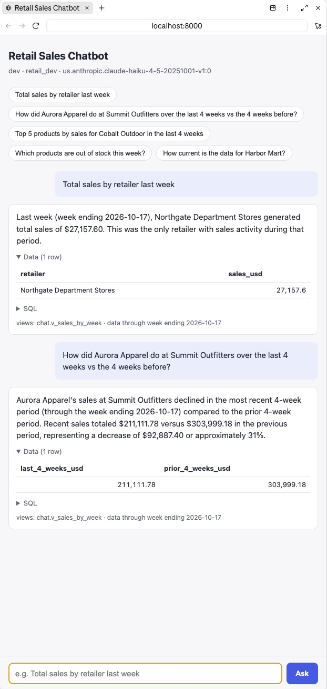
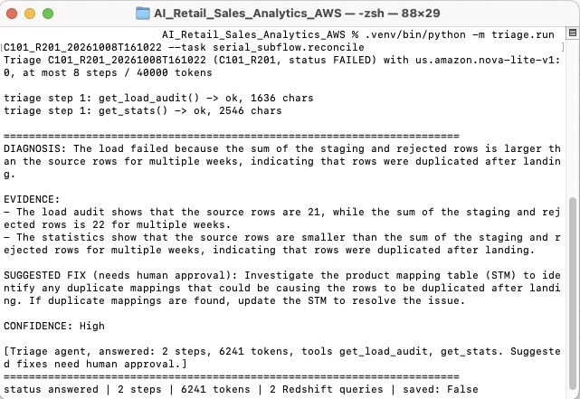
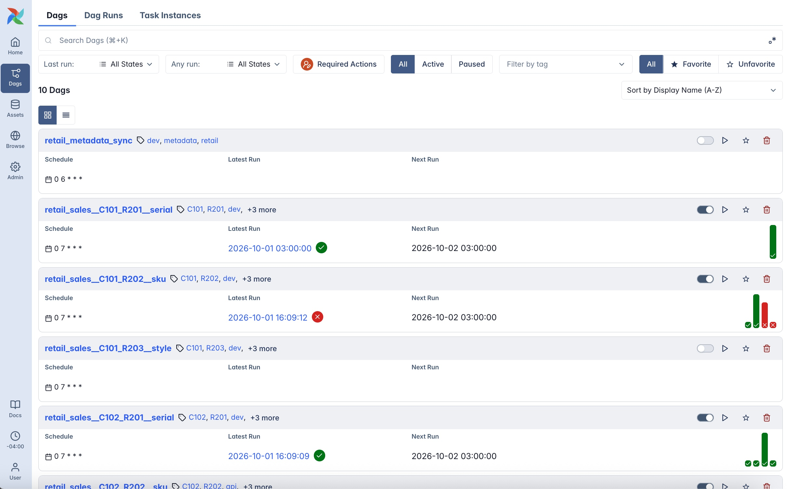
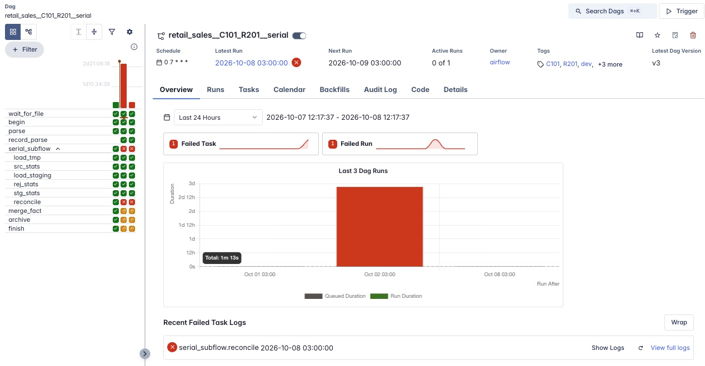
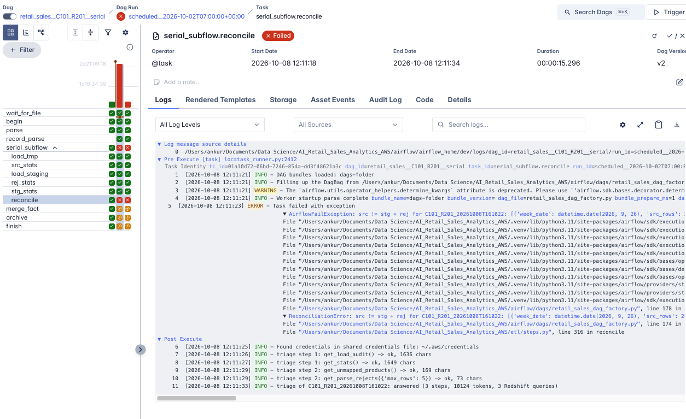
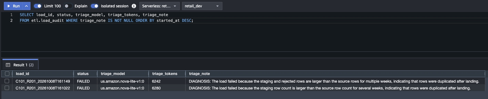
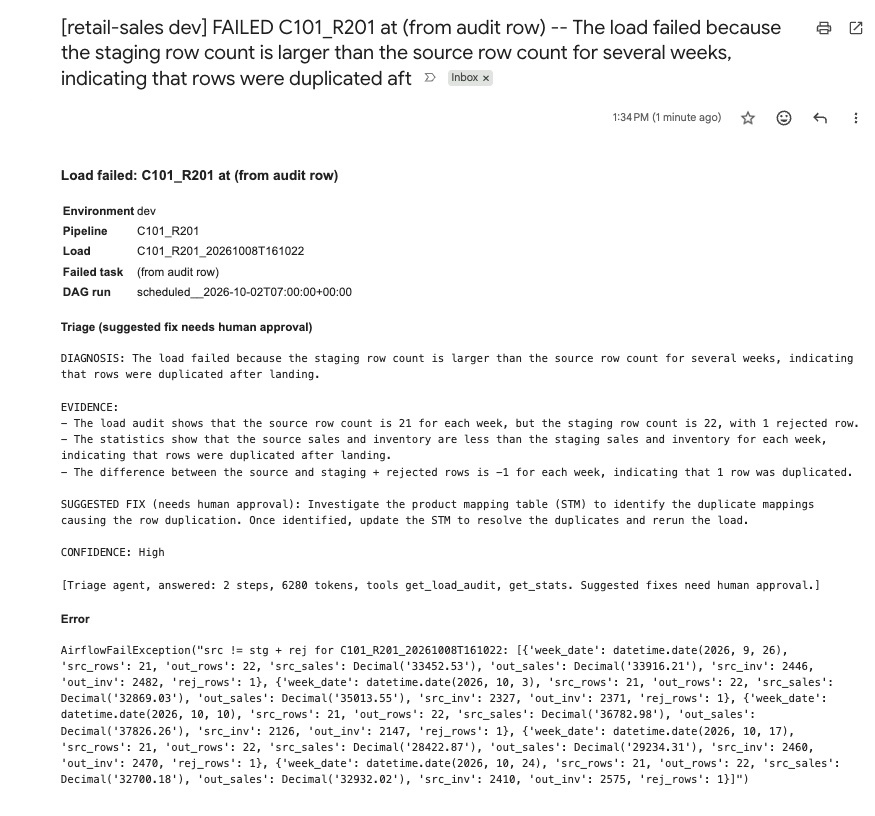

# AI Retail Sales Analytics on AWS: Metadata-Driven Pipeline, Analytics Chatbot and Pipeline Triage Agent

Brands (clients) receive weekly sell-through data from their retailers:
sales and on-hand inventory by week. Each retailer sends it in its own
layout, at its own product level, by file drop or by API. This project loads
every client/retailer feed into a single weekly fact table on **Redshift
Serverless**, orchestrated by **Airflow**, with **S3** as the landing zone.

It is a rebuild of a legacy **ibi Data Migrator** setup. That setup had one
hand-built flow per client/retailer, each with its own hard-coded parameters
(week start/end, client_id, retailer_id, source/output/archive dirs). Here, a
**metadata table** drives everything: one row per feed, and a DAG factory
generates one DAG per row.

On top of the fact table, an **analytics chatbot** answers plain-English
questions: it turns the question into SQL against curated views, runs it
with a read-only user, and summarizes the result. It runs on **Claude via
Amazon Bedrock** (as in
[Member Engagement](https://github.com/ankur715/Member_Engagement_Pipeline_AWS))
or **Gemini** (as in [Web_App](https://github.com/ankur715/Web_App)). See
[Analytics chatbot](#analytics-chatbot).

When a load fails, including when the reconcile gate finds
`src != stg + rej`, a **Pipeline Triage Agent** investigates with read-only
tools and writes a plain-English diagnosis and suggested fix for a person
to approve. See [Pipeline Triage Agent](#pipeline-triage-agent).

## At a glance

| | What it does | Built with |
|---|---|---|
| **Metadata-driven pipeline** | One DAG per client/retailer feed, generated from a metadata table; serial, SKU and style feeds converge on one weekly fact table, upserted over a rolling 5-week window | Airflow 3, S3, Redshift Serverless, Terraform |
| **Reconcile gate** | Nothing reaches the fact table unless `src = stg + rej` for every week, in rows, sales and inventory | `etl.etl_stats`, `etl.load_audit` |
| **Analytics chatbot** | Plain-English question → SQL on curated views (read-only user, validated SQL) → answer with its data | FastAPI, Claude on Bedrock or Gemini |
| **Pipeline Triage Agent** | When a load fails, investigates with read-only tools and writes a diagnosis and a fix for a person to approve | Bedrock Converse tool use, Nova Lite (Claude Haiku 4.5 optional) |

<table>
<tr>
<td width="50%" valign="top"><b>Analytics chatbot</b><br><a href="#analytics-chatbot"></a></td>
<td width="50%" valign="top"><b>Pipeline Triage Agent</b>: a reconcile failure diagnosed for under a tenth of a cent<br><a href="#pipeline-triage-agent"></a></td>
</tr>
</table>

## Architecture

```
 Retailer feeds                        S3: retail-sales-lake-<acct>/<env>/
 ─────────────                         ──────────────────────────────────────────────
 R201 Northgate  CSV  serial level ─┐   landing/<client>/<retailer>/  files as received
 R202 Summit     XLSX sku level    ─┼─> parsed/.../<load_id>/output_<client>_<retailer>.csv  (what Redshift COPYs)
 R203 Harbor     CSV  style level  ─┘   rejects/.../<load_id>/        parse rejects + unmapped products
 C102@R202       REST API (mock) ────>  archive/<client>/<retailer>/  source files after a successful load
                                                     │ COPY (IAM role, parsed/ only)
                                                     ▼
 Redshift Serverless: retail_dev / retail_prod ───────────────────────────────────────
   etl.pipeline_config ─► DAG factory      dim.product, dim.product_stm (source-to-target map)
   landing.tmp_<level> ─► landing.prestg_<level> ─► stage.stg_sales ─MERGE─► fact.fact_sales
   etl.etl_stats (src / stg / rej)   etl.load_audit   etl.v_load_reconciliation   fact.v_weekly_sales
        │                                  ▲                                       │
        │ failed load                      │ triage_note (for a person to approve) │ chat.* views
        ▼                                  │                                       ▼
 Pipeline Triage Agent: Bedrock Converse + 6 read-only tools        Analytics chatbot (FastAPI + LLM)
```

### One DAG per metadata row



*Local dev Airflow: one generated DAG per `etl.pipeline_config` row plus `retail_metadata_sync`; schedules come from the `schedule` column (shown in the browser's UTC−4, so 07:00 UTC reads 03:00).*

`build_dag(row)` in `airflow/dags/retail_sales_dag_factory.py` is the only
DAG definition. Each metadata column switches one thing, and everything
else is shared code:

| Column | What it changes |
|---|---|
| `pipeline_id`, `client_id`, `retailer_id` | DAG id and tags; every SQL step is scoped to this pair and its `load_id`; parser validation (or stamping) of client/retailer |
| `product_level` | the subflow: `etl/levels.py` gives the landing tables, whether `prestg` exists, the key columns, and the STM join |
| `source_type` | `s3` → `wait_for_file` sensor on `source_location`; `api` → `extract_api` |
| `file_format` | the parser's reader: CSV, XLSX (header-row detection) or JSON |
| `schedule`, `lookback_weeks`, `is_active` | cron, the automation window, and whether the DAG exists at all |

```
retail_sales__C101_R201__serial   (s3, daily)
  wait_for_file ─► begin ─► parse ─► record_parse ─► serial_subflow ─────────────────────────────────────────────┐
                                     load_tmp ─► src_stats ─► load_staging ─► stg_stats ─┐       │
                                                                          └─► rej_stats ─┴► reconcile
                                                                                                 ▼
                                                                         merge_fact ─► archive ─► finish

retail_sales__C101_R202__sku      sku_subflow:   load_tmp ─► load_prestg ─► src_stats ─► ... (same)
retail_sales__C101_R203__style    style_subflow: load_tmp ─► load_prestg ─► src_stats ─► ... (same)
retail_sales__C102_R202__sku      (api, Sundays) begin ─► extract_api ─► parse ─► record_parse ─► sku_subflow ─► ...
```

| ibi Data Migrator | Here |
|---|---|
| Per-flow parameters (week start/end, client_id, retailer_id, source_dir, output_dir, archive_dir) | `etl.pipeline_config` row + `RETAIL_ENV` + optional `start_week`/`end_week` DAG params |
| Python parser → `output.csv`, read through a synonym | `etl/parsers.py` → `s3://…/parsed/<client>/<retailer>/<load_id>/output_<client>_<retailer>.csv`, `COPY` into `landing.tmp_<level>` |
| Load to tmp (serial) / prestg_sku / prestg_style | `load_tmp`, plus `load_prestg` for sku/style (rolls store rows up to the key columns) |
| src_stats / stg_stats / rej_stats | `etl.etl_stats` with `source` = `src` / `stg` / `rej`, by week, client and retailer |
| Load to staging: LEFT JOIN to the dimension STM | `stage.stg_sales`, LEFT JOIN `dim.product_stm`; `product_id IS NULL` = rejected |
| Merge staging to facts, last 5 weeks | Redshift `MERGE` into `fact.fact_sales` over the load window |
| *(new)* | `reconcile`: fails the run unless src = stg + rej (rows, sales, inventory) for every week |
| *(new)* | `etl.load_audit`: one row per run with window, files, parse stats, inserted/updated counts; `etl.load_files`: one row per source file |

## The three product levels

| Level | Source columns | Landing | Maps on (`dim.product_stm`) |
|---|---|---|---|
| serial | week_date, client, retailer, product_id, sales, inventory | `tmp_serial` | `src_product_id` (retailer serial number → internal SKU `product_id`) |
| sku (style-color-size) | week_date, retailer, client, style, color, size, sales, inventory | `tmp_sku` → `prestg_sku` | `style + color + size` → SKU `product_id` |
| style | week_date, retailer, client, style, sales, inventory | `tmp_style` → `prestg_style` | `style` → style-level `product_id` |

All three converge in `stage.stg_sales` (week, client, retailer, product_id,
metrics), so a single MERGE serves every feed.

## Metadata table

`config/pipeline_config.csv` is the reviewed seed for `etl.pipeline_config`:

| pipeline_id | client | retailer | product_level | source_type | file_format | schedule | lookback_weeks | promoted_to_prod |
|---|---|---|---|---|---|---|---|---|
| C101_R201 | C101 | R201 | serial | s3 | csv | `0 7 * * *` | 5 | ✓ |
| C101_R202 | C101 | R202 | sku | s3 | xlsx | `0 7 * * *` | 5 | ✓ |
| C102_R202 | C102 | R202 | sku | **api** | json | `0 8 * * 0` | 5 | ✓ |
| C103_R203 | C103 | R203 | style | s3 | csv | `0 7 * * *` | 5 | ✗ (dev only) |
| … 9 rows | | | | | | | | |

**Parallel pipelines and the `redshift` pool.** All feeds share the
landing, stage, stats and fact tables, and Redshift's serializable isolation
aborts concurrent writers (error 1023). So every task that writes to
Redshift runs in a 1-slot Airflow pool. S3 and API work (`wait_for_file`,
`extract_api`, `parse`, `archive`) runs in parallel.

When several pipelines wait for the slot, Airflow takes the highest
`priority_weight` first, then the oldest run. `weight_rule="upstream"`
gives later steps more weight, so a load that has started runs through
`merge_fact` before the next pipeline's `load_tmp` begins. This was
verified live: with three DAGs triggered together, one load ran tmp →
merge without interleaving while the other's API pull and parse ran
alongside it. `max_active_runs=1` keeps a pipeline from overlapping itself:
a manual run waits behind a scheduled run whose sensor is still polling.
The failure callback can't use a pool, so it retries on error 1023.

**Updating the metadata.** The CSV is the source of truth, reviewed like code:

1. Edit `config/pipeline_config.csv`: add a row for a new feed, or change
   `schedule`, `lookback_weeks`, `is_active` or `promoted_to_prod`. Open a
   PR to `dev`.
2. `RETAIL_ENV=dev python -m etl.seed --metadata-only` replaces
   `etl.pipeline_config` in `retail_dev`.
3. Trigger `retail_metadata_sync`, or wait for its 06:00 run. The snapshot
   refreshes, and within about 30 seconds Airflow shows the new or changed
   DAG. A pipeline whose `is_active` is false simply disappears; its run
   history is kept.
4. After the merge to `main`: run step 2 with `RETAIL_ENV=prod`, then sync
   in the prod Airflow.

Don't hand-edit `etl.pipeline_config` with SQL: the next seed overwrites it.

**The DAG factory never queries Redshift.** Airflow re-parses DAG files about
every 30 seconds, and each query would wake (and bill) the Serverless
workgroup. Instead, the `retail_metadata_sync` DAG copies
`etl.pipeline_config` into a local JSON snapshot once a day (or on demand),
and the factory reads that snapshot. Before the first sync, for example in
CI, it falls back to the seed CSV.

## Scheduling and the load window

- **S3 feeds run daily.** `wait_for_file` is a reschedule-mode sensor: it
  doesn't hold a worker while waiting, and it *skips* the run if no file
  lands within 8 hours. A file arrives once a week, so most days nothing
  happens and Redshift is never touched.
- **The API feed runs Sundays at 08:00**, after the Saturday week closes.
- **Week = week-ending Saturday.** Retailers restate recent weeks (returns,
  late POS uploads), so every weekly file re-sends the last 5 weeks, and each
  automation run upserts exactly that window:
  - *S3:* the 5 weeks ending at the week in the file name, e.g. `R201_C101_20261003.csv`.
  - *API:* the 5 weeks ending at the last completed Saturday.
- **History or backfill:** trigger the DAG with `{"start_week": "2026-07-11", "end_week": "2026-09-26"}`.
- **Several files in one run.** Everything waiting in landing/ (up to 20
  files) is loaded together:
  - a backlog of weekly drops (for example, the files for Oct 10 and Oct 17
    both waiting)
  - one drop split into parts (`R201_C101_20261017_part1.csv`, `_part2`)

  Parts of the same week are combined. Where drops overlap, the newest
  file's rows win each week. The window runs from the oldest file's 5 weeks
  to the newest file's week. The end state is exactly what loading the files
  one by one would produce, but in one load, one MERGE and one audit row.
  `etl.load_files` records what each file contributed, including the rows a
  newer file superseded.
- **Rows newer than the window fail the parse instead of being dropped.**
  Loading the file would otherwise archive data that never reached the fact
  table. (Found during the first Airflow run, see below.)

## How runs start: today and event-driven options

Airflow's always-on services (scheduler, DAG processor, triggerer) don't
move data. The DAG processor only re-reads the factory file about every
30 seconds to rebuild DAG *definitions* (no S3, no Redshift). Work happens
only when the scheduler creates a run, from a cron schedule or a manual
trigger.

| Option | How a run starts | Latency | Status |
|---|---|---|---|
| **A. Cron + sensor** | 07:00 UTC daily; `wait_for_file` checks landing every 30 min for up to 8 h, and the run skips if nothing lands | ≤ 30 min | **Implemented** |
| **B. Cron, several times a day** | e.g. `0 7,13,19 * * *`; the first step lists landing and skips immediately if empty | ≤ the gap between runs | Config only: change `schedule` in the metadata and shorten the sensor timeout |
| **C1. S3 event → SQS → Airflow** | S3 "file created" event → SQS queue; Airflow 3's triggerer listens to the queue and starts the DAG | seconds | Not implemented |
| **C2. S3 event → Lambda → Airflow REST API** | Lambda calls `POST /api/v2/dags/{dag_id}/dagRuns` with the file keys | seconds | Not implemented (decided against) |

Everything after `begin` is identical in all four. Only how the run starts
changes, because a run already loads every pending file under the
client/retailer's landing path.

### What event-driven would cost

| Item | Volume here (hundreds of files a week) | Cost |
|---|---|---|
| S3 event notifications | per file | free |
| SQS | a few thousand messages, plus Airflow's long-poll requests (~130k/month) | free tier is 1M requests/month → **$0** |
| Lambda (C2 only) | a few thousand ~1 s invocations | free tier is 1M requests + 400k GB-s/month → **$0** |
| **An Airflow that is always on and reachable** (the real cost) | — | Laptop: $0, but runs only while it's awake, and Lambda can't reach `localhost`. Small EC2 running Airflow: roughly **$30–40/month**. Managed MWAA: roughly **$250–350+/month** for the smallest environment. Check current AWS pricing. |
| Build effort | Terraform for the bucket notification + queue (+ Lambda and an API-auth secret for C2), plus the DAG/trigger changes and tests | about a day |

**Decision:** stay on option A. Weekly retailer files don't need
seconds-level latency, and the event services save nothing until Airflow
runs on an always-on host. If that happens, C1 (SQS) is preferred over the
Lambda path: nothing has to reach into Airflow, so no public endpoint or
API credentials are needed, and the AWS side stays $0 at this volume.

## Scaling to hundreds of retailers × hundreds of clients

One DAG per client/retailer pair suits a handful of feeds, not tens of
thousands. The same metadata-driven design scales by changing the unit of
work:

- **One DAG per retailer (or per retailer + level), mapped over clients.**
  The DAG lists which clients' files arrived and runs the subflow per pair
  with dynamic task mapping (`.expand()`). The metadata becomes the list of
  *expected* feeds, not a list of DAGs.
- **Retailer layouts as metadata.** A per-retailer parser spec (column
  synonyms, date format, header row, rows to skip) replaces code, so
  onboarding Amazon or Saks is a config row plus a sample file.
- **Set-based Redshift work.** Instead of serializing pairs through a
  1-slot pool, process a batch together: one COPY of all of a retailer's
  parsed files, one mapping pass, one MERGE. Alternatively, give each load
  its own temp staging tables so loads stop colliding and the pool can grow.
- **Parsing off the Airflow workers** (ECS/Fargate, Lambda or Glue), and
  Airflow on MWAA or Astronomer with Celery/Kubernetes executors.

## Dev vs prod

The same code and DAGs run in both environments. `RETAIL_ENV` only changes
*where* data goes:

| | dev | prod |
|---|---|---|
| Redshift database | `retail_dev` | `retail_prod` (same namespace, isolated database) |
| S3 prefix | `dev/landing`, `dev/parsed`, … | `prod/landing`, … |
| Pipelines | every row of the seed | rows with `promoted_to_prod = true` |
| Airflow | `./start_airflow.sh` on :8080 | `RETAIL_ENV=prod ./start_airflow.sh` on :8081, with its own `AIRFLOW_HOME` |

**History in prod:** prod reads only `prod/landing/`. Files loaded in dev
are archived under `dev/`, so a prod history load needs them dropped into
`prod/landing/` again. Production setups usually avoid that with one
prod-owned raw zone that both environments read, or by copying prod
landing down to dev.

**Promotion:** develop a new feed in dev, load its history with
`start_week`/`end_week`, and check `etl.v_load_reconciliation` and the
unmapped-products file. Then flip `promoted_to_prod` in a PR to `main`,
re-seed prod, and run the prod history load once. After that, the daily
schedule only upserts the rolling 5 weeks. Schema changes go through
versioned, checksummed migrations (`sql/redshift/V*.sql`) applied to dev
first. CI runs on `dev` and `main`.

## Analytics chatbot


*Local chatbot on Claude Haiku 4.5 (Bedrock): each answer shows its data,
the SQL behind it (collapsed), the views used, and how current the data is.*

A separate always-on FastAPI service (`chatbot/`). It isn't part of Airflow:
the DAGs keep the data fresh, and the chatbot only reads curated views.

```
POST /api/chat {"message": "Top 5 products for Cobalt Outdoor in the last 4 weeks"}
 1. route      Gemini sees only a one-line summary of each view -> picks the views it needs
 2. write_sql  Gemini gets ONLY those views' columns, known values and examples -> one SELECT (JSON output)
 3. validate   sqlglot: one read-only statement, only the routed views, LIMIT <= 500
 4. run        as chat_reader (SELECT on chat.* only, 30 s timeout)
               on a validation/SQL error: one repair round with the exact error
 5. summarize  the LLM answers from the returned rows only, given the SQL that produced them
               (its WHERE filters aren't repeated in the result columns), with "data through ..."
-> {answer, sql, views, columns, rows, data_as_of}
```

**Metadata limits what each question can see.** `config/chat_catalog.yaml`
describes each curated view: a summary for routing, the grain, column
meanings, which columns' distinct values to show, and example
question → SQL pairs. Business rules (Saturday weeks, `weeks_ago`, never
summing inventory across weeks) are written there once.
- **Each question only sees what it needs:** the SQL step receives the
  metadata of the routed views only, so prompts stay small.
- **The validator enforces it:** queries may use only those views. A query
  against an un-routed view, `fact.*` or `etl.*` is rejected and repaired
  before it reaches Redshift.
- **Separate from pipeline metadata:** `pipeline_config.csv` says how to
  *load* a feed; `chat_catalog.yaml` says how to *ask about* the data.
  Onboarding a new feed needs no chatbot change.

| Curated view (`sql/redshift/V010__chat_views.sql`) | Grain | For |
|---|---|---|
| `chat.v_sales_by_week` | week × brand × retailer × category | Totals, trends, comparisons, week-over-week |
| `chat.v_weekly_sales` | week × brand × retailer × product | Products, styles, colors, sizes, top-N, stockouts |
| `chat.v_calendar` | week | Named months/quarters; `weeks_ago` (0 = latest loaded week) |
| `chat.v_data_freshness` | brand × retailer | "How current is the data?" |

**Guardrails:**
- **Database access:** `chat_reader` (`python -m chatbot.setup_reader`) can
  read only the chat schema. It has USAGE on fact/dim/etl so views resolve,
  but no SELECT on any table there. Verified: `SELECT * FROM fact.fact_sales`
  → *permission denied*.
- **Query safety:** sqlglot parses the SQL rather than keyword-matching it
  (Web_App's check would reject a column named `updated_at`). Results are
  capped at 500 rows, with a 30 s timeout.
- **Load and cost:** repeated questions are cached for 15 minutes, so they
  don't call Gemini or wake Redshift.
- **Gemini errors:**
  - overload (503) and per-minute limits (429): retried with backoff,
    honouring Gemini's `retryDelay`
  - a daily quota: fails fast with a clear message instead of retrying
- **Off-topic questions** route to no view and get a polite refusal; no SQL
  runs.

**Two LLM providers, one set of prompts.** `LLM_PROVIDER` picks which one
answers; `chatbot/llm.py` holds the prompts, and each provider module only
makes the calls:

| | `bedrock` (local default in `.env`) | `gemini` |
|---|---|---|
| Model | Claude through Amazon Bedrock (`anthropic` SDK). Code default `claude-opus-5-5`; this account can call **Claude Haiku 4.5** via its inference profile, so `.env` sets `BEDROCK_MODEL=us.anthropic.claude-haiku-4-5-20251001-v1:0`, `LLM_BEDROCK_ENDPOINT=runtime` | `GEMINI_MODEL` (default `gemini-3.6-flash`, as in Web_App) |
| Credentials | The AWS profile (`retail-pipeline`). Terraform's `chatbot-bedrock-invoke` policy allows only the listed models | `GOOGLE_API_KEY` |
| Structured output | `messages.parse(output_format=<Pydantic model>)` | `response_schema` |
| Limits and cost | Pay per token: a question is 3 short calls, about a cent with Haiku. No daily cap | Free tier: **about 20 requests per model per day**, so roughly 6 new questions a day |
| Errors → 503 with a clear message | Throttling and 5xx after the SDK's retries; IAM or model-access problems reported as configuration; refusals reported as declined | 503 overload and per-minute 429 retried, honouring `retryDelay`; a daily quota fails fast |

Gemini was the first provider. Testing used up its free daily quota within
a few questions, which is why the local setup switched to Bedrock, the same
way the Member Engagement project calls Claude.

```bash
RETAIL_ENV=dev .venv/bin/python -m etl.migrate          # creates the chat views (V010)
RETAIL_ENV=dev .venv/bin/python -m chatbot.setup_reader # read-only user (CHAT_REDSHIFT_PASSWORD in .env)
.venv/bin/uvicorn chatbot.app:app --port 8000           # http://localhost:8000
```

**Verified live** in dev, on Bedrock with Claude Haiku 4.5. The questions
were routed to the right views and produced correct SQL, a few seconds
each:

| Question | Routed to | Answer (abridged) |
|---|---|---|
| Total sales by retailer last week | `v_sales_by_week` | Northgate $27,157.60 (only Northgate has reported the latest week, Oct 17) |
| Aurora Apparel at Summit Outfitters, last 4 vs prior 4 weeks | `v_sales_by_week` | $211,111.78 vs $303,999.18, down $92,887.40 |
| Top 5 products for Cobalt Outdoor, last 4 weeks | `v_weekly_sales` | Daypack $98,781.12, Fleece Vest, Rain Shell, Trek Pant, Beanie (all at Harbor Mart) |
| Sales by month for Bramble Footwear | `v_sales_by_week` + `v_calendar` | Jul–Oct by month, noting October is partial |
| Which products are out of stock this week? | `v_weekly_sales` | None |
| How current is the data for Harbor Mart? | `v_data_freshness` | Through Oct 3, two weeks behind the latest week loaded |
| What is the weather in Paris? | — | Polite refusal; no SQL run |

The first live run caught a real issue: two answers second-guessed
correctly filtered rows. For example, it said the products were "Harbor
Mart, not Cobalt Outdoor", because the result columns didn't repeat the
`brand = 'Cobalt Outdoor'` filter. The summary step now receives the SQL as
well. On Gemini, one question answered end to end before the free-tier
quota ran out.

## Pipeline Triage Agent

When a load fails, someone has to work out why before anything can be
fixed. The triage agent does that first pass. It reads the evidence the
pipeline already records and writes its diagnosis and a suggested fix to
the load's audit row. **A person reviews it and decides; the agent changes
nothing.**

```
task fails (after retries)         reconcile finds src != stg + rej (fails at once, no retries)
            \                       /
             _mark_failed (DAG on_failure_callback)
               1. etl.load_audit.status = FAILED              (as before, always first)
               2. triage_failed_load(load, failed task, error) (never raises)
                    Bedrock Converse loop (boto3 bedrock-runtime, toolConfig), at most 8 model calls:
                      model -> toolUse -> read-only tool -> toolResult -> model -> ... -> final text
               3. triage_note, triage_model, triage_tokens -> etl.load_audit  (V011)
                                                   |
                         a person reads the note and approves or applies the fix
```

**How it's built:** a plain tool-use loop over the Amazon Bedrock Runtime
**Converse API** (`triage/agent.py`). It uses no Bedrock Agents,
AgentCore, Knowledge Bases, OpenSearch, Lambda, or any service outside
this AWS account. Each step sends the conversation plus the six tool
definitions. The model either asks for tools, which run locally and go
back as `toolResult` blocks, or answers in fixed sections: `DIAGNOSIS`,
`EVIDENCE`, `SUGGESTED FIX (needs human approval)` and `CONFIDENCE`. The
system prompt lists the common failure patterns, for example
"stg + rej larger than src means a duplicated mapping row".

**Tools** (`triage/tools.py`): fixed, read-only Python functions bound to
the failed load, so the model can't pick another load, table or query.

| Tool | Reads | Redshift queries |
|---|---|---|
| `get_load_audit` | The audit row: error, window, files, parse stats | 1 |
| `get_stats` | src / stg / rej rows, sales and inventory by week, with `src - (stg + rej)` computed per week | 1 |
| `get_unmapped_products` | The S3 `unmapped_products.csv`; `stage.stg_sales` only if no file was written | 0 or 1 |
| `get_parse_rejects` | The S3 `parse_rejects.csv`: counts by reason plus sample rows | 0 |
| `get_file_history` | `etl.load_files` joined to `etl.load_audit` for recent loads, plus files still in landing | 1 |
| `get_pipeline_config` | The local metadata snapshot | 0 |

So a whole investigation is **at most 4 small queries on one connection**,
and the Serverless workgroup wakes once, usually already awake from the
failing load. Results are cached per run, so a repeated tool call is free.

**Guardrails:**
- **Read-only:**
  - The tools connect as `triage_reader` (`python -m triage.setup_reader`),
    which has SELECT on exactly five tables: `etl.load_audit`,
    `etl.etl_stats`, `etl.load_files`, `etl.pipeline_config` and
    `stage.stg_sales`.
  - There is no free-form SQL. The connection wrapper runs only *named*
    queries from a fixed dictionary, and a test checks that each is a
    single SELECT on those tables.
  - Writing the note is a separate step, done by the ETL user.
- **Human approves fixes:** the agent has no tool that changes anything.
  Its fix is text in `triage_note` that a person reviews before acting, for
  example removing a duplicate mapping row through a PR, then clearing the
  failed task.
- **Bounded:**
  - `TRIAGE_MAX_STEPS` (8 model calls); on the last one the model is told
    to answer from the evidence it has.
  - `TRIAGE_MAX_TOKENS` (40,000 input + output for the whole run).
  - At most 1,500 output tokens per call.
  - Each tool result is truncated to 6,000 characters.
  - Hitting a cap stops the loop and records its partial findings.
- **Never masks the real failure:**
  - The `FAILED` status is written first.
  - The agent runs inside `try/except`, and `triage_failed_load()` never
    raises: Bedrock errors, tool errors and save errors are logged.
  - Airflow keeps reporting the task's own exception. A test makes both
    steps raise and checks that the callback still returns cleanly.
- **Off by default:** with `LLM_PROVIDER=none`, the default and what CI
  uses, the agent is skipped without a Bedrock client being created.

**Models:**

| `TRIAGE_MODEL` | Bedrock model | Use |
|---|---|---|
| `nova-lite` (default) | `us.amazon.nova-lite-v1:0` | Cheapest model that does tool use reliably |
| `claude-haiku` | `us.anthropic.claude-haiku-4-5-20251001-v1:0` | Stronger reasoning for messier failures, about 15× the price |
| any full id | as given | e.g. another inference profile |

**Cost per run:** a typical investigation is 3–5 model calls of about
16,000 input and 1,000 output tokens in total. The conversation is
re-sent each step, so input dominates.

| Model | Price per 1M tokens (input / output, us-east-1 on-demand) | Typical run | Worst case at the 40k-token cap |
|---|---|---|---|
| Nova Lite | about $0.06 / $0.24 | **about $0.001** (live: 6–10k tokens, under $0.001) | under $0.01 |
| Claude Haiku 4.5 | about $1 / $5 | **about $0.02** | about $0.06–0.20 |

These are estimates: check current Bedrock pricing. `triage_tokens` on
each audit row records actual usage. The Redshift side is up to 4 small
queries on a workgroup the failed load usually woke already. Triage runs
only when a load fails, not on every run.

> **Billing check if you use Claude:** after a Claude run, open **Billing
> and Cost Management → Bills** and confirm the charges appear under
> **Amazon Bedrock**, not **AWS Marketplace**. Anthropic models on Bedrock
> can be billed through Marketplace on some accounts, and promotional AWS
> credits often don't cover Marketplace charges. Nova Lite is an Amazon
> model, so it always bills under Amazon Bedrock.

**Setup** (once per environment):

```bash
RETAIL_ENV=dev .venv/bin/python -m etl.migrate           # V011: triage_note / triage_model / triage_tokens
RETAIL_ENV=dev .venv/bin/python -m triage.setup_reader   # read-only user (TRIAGE_REDSHIFT_PASSWORD in .env)
(cd infra/terraform && terraform apply)                 # allow Nova Lite in the Bedrock invoke policy
# .env: LLM_PROVIDER=bedrock (anything but none), TRIAGE_MODEL=nova-lite or claude-haiku
```

**Verified live** in dev, on Nova Lite. To create a real failure, one
serial-level mapping row was duplicated in `dim.product_stm` and a new weekly
file was dropped:
- **The DAG:** `serial_subflow.reconcile` failed on its first try (no
  retries), and the downstream tasks were skipped, so nothing reached the
  fact table.
- **The agent, from the failure callback:** called `get_load_audit`,
  `get_stats`, `get_unmapped_products` and `get_parse_rejects` in 3 steps.
  It used 10,124 tokens and 3 Redshift queries, and saved its note to the
  audit row. Its diagnosis: *"a source key matches more than one row in the
  product mapping table (STM), causing the staging join to multiply rows"*,
  confidence high.
- **The same load through `triage.run`:** 2 steps and 6,280 tokens, about
  $0.0005 on Nova Lite.
- **Two fixes from the first run:**
  - Nova's `<thinking>` text had leaked into the note; it's now stripped.
  - One evidence line had misread the raw stats; `get_stats` now also
    states each mismatch in words, for example *"rows src 21 vs stg + rej
    22 (1 duplicated)"*.
- **Read-only confirmed:** `triage_reader` was refused `UPDATE` and
  `DELETE` on `etl.load_audit` and `etl.etl_stats`, and `SELECT` on
  `fact.fact_sales`.

**The live run, in screenshots:**

1. Reconcile failed on the first try; merge, archive and finish were
   skipped, so nothing reached the fact table.

   

2. The agent ran from the failure callback. The task log shows the
   reconcile error, then each tool call and the result: *answered (3
   steps, 10124 tokens, 3 Redshift queries)*.

   

3. The same load through the CLI: the steps, then the diagnosis and the
   suggested fix for a person to approve.

   

4. The note saved on each failed load's audit row, with the model and the
   tokens used, in Redshift Query Editor v2.

   

**Run it by hand** on any failed load and watch each step:

```bash
.venv/bin/python -m triage.run <load_id>            # print the diagnosis
.venv/bin/python -m triage.run <load_id> --write    # ...and save it to etl.load_audit
```

### Failure email with the triage note

The diagnosis goes to whoever is on call, so they get the likely cause
along with the alert instead of having to look it up. The failure callback
runs three isolated steps:
1. mark the load `FAILED`
2. triage it
3. send **one email** (`etl/alerts.py`)

```
Subject: [retail-sales dev] FAILED C101_R201 at serial_subflow.reconcile -- A source key matches more than one STM row ...
Body:    environment, pipeline, load, failed task, DAG run
         Triage (suggested fix needs human approval): DIAGNOSIS / EVIDENCE / SUGGESTED FIX / CONFIDENCE
         Error (truncated), link to the Airflow log, the audit-row query
```

- **Every final task failure is emailed.** A failure before a load
  existed, with nothing to triage, gets an email that says so. With
  `LLM_PROVIDER=none`, the email says the agent is off.
- **It never masks the failure:** like the agent, `send_failure_email()`
  logs SMTP problems and never raises.
- **Off unless configured:** it needs `SMTP_USER`, `SMTP_PASSWORD` and
  `ALERT_EMAIL` in `.env`, so CI and tests never send.
  - **Gmail:** `smtp.gmail.com:587` (STARTTLS) with an **App Password**
    (Google Account → Security → 2-Step Verification → App passwords), not
    the account password.
  - **Where settings live:** the recipient address and the password stay
    in `.env`, never in committed files.

The email from the live run, carrying the agent's diagnosis of the
duplicated mapping row (sender redacted):



```bash
.venv/bin/python -m etl.alerts --test               # send a test email (checks the SMTP settings)
.venv/bin/python -m etl.alerts --load <load_id>     # email an existing failed load with its saved triage note
```

## Dummy data

3 clients (Aurora Apparel, Bramble Footwear, Cobalt Outdoor) × 3 retailers.
Each client has 20 SKUs (5 styles × 2 colors × 2 sizes) and 12 weeks of
history plus one weekly drop. `data_gen/` produces each retailer's messy
layout:
- R201: `MM/DD/YYYY` dates, `"$1,234.50"` amounts, serial numbers with leading zeros
- R202: XLSX with a title row above the header, one row per store
- R203: padded lower-case headers and a `TOTAL` row at the bottom
- API: camelCase JSON, cursor-paged

Values are a pure function of product, store, week and file date, so
restated weeks drift in a reproducible way. One key per level is
deliberately missing from the STM, so `rej_stats` always has something to
show.

## Setup

```bash
# 0. Get the code
git clone https://github.com/ankur715/AI_Retail_Sales_Analytics_AWS.git
cd AI_Retail_Sales_Analytics_AWS

# 1. Infrastructure (S3, Redshift Serverless, IAM) -- ~5 min
cd infra/terraform
cp terraform.tfvars.example terraform.tfvars          # your IP, a Redshift password
terraform init && terraform apply
aws configure set aws_access_key_id "$(terraform output -raw pipeline_access_key_id)" --profile retail-pipeline
aws configure set aws_secret_access_key "$(terraform output -raw pipeline_secret_access_key)" --profile retail-pipeline

# 2. Python (one venv for Airflow + the etl package)
cd ../..
python3.11 -m venv .venv
(cd airflow && ../.venv/bin/pip install -r requirements.txt)
cp .env.example .env                                   # paste the terraform outputs

# 3. Schema + seed, per environment
.venv/bin/python -m etl.migrate && .venv/bin/python -m etl.seed
RETAIL_ENV=prod .venv/bin/python -m etl.migrate && RETAIL_ENV=prod .venv/bin/python -m etl.seed

# 4. Mock retailer API (separate terminal)
.venv/bin/uvicorn mock_api.main:app --port 9100

# 5. Dummy files -> S3 landing (12-week history, then a weekly drop)
.venv/bin/python -m data_gen.generate --week-end 2026-09-26 --weeks 12 --upload
.venv/bin/python -m data_gen.generate --week-end 2026-10-03 --weeks 5 --upload

# 6. Airflow -> http://localhost:8080
.venv/bin/python -c "from etl import metadata; metadata.sync_snapshot()"
airflow/start_airflow.sh
```

### Run it locally

Each service runs in its own terminal, from the project root:

| Service | Command | Open |
|---|---|---|
| Airflow (dev) | `airflow/start_airflow.sh` | http://localhost:8080 (user `admin`; password in `airflow/airflow_home/dev/simple_auth_manager_passwords.json.generated`) |
| Mock retailer API (needed by the C102 @ R202 API feed) | `.venv/bin/uvicorn mock_api.main:app --port 9100` | http://localhost:9100/docs (endpoints; `/v1/sales` needs `Bearer local-dev-token`) |
| Analytics chatbot | `.venv/bin/uvicorn chatbot.app:app --port 8000` | http://localhost:8000 |

```bash
airflow/start_airflow.sh                                  # 1. orchestration
.venv/bin/uvicorn mock_api.main:app --port 9100           # 2. retailer API (API feeds fail without it)
.venv/bin/uvicorn chatbot.app:app --port 8000             # 3. chatbot (LLM_PROVIDER in .env)
```

Stop a service with Ctrl+C in its terminal. Stopping Airflow leaves its
child processes running, so stop them too (from the project root):

```bash
pkill -f "$(pwd)/.venv/bin/airflow"
```

To run one pipeline from the CLI without Airflow (same steps as its DAG):

```bash
.venv/bin/python -m etl.run C101_R201 --start-week 2026-07-11 --end-week 2026-09-26   # history
.venv/bin/python -m etl.run C101_R201                                                 # automation (all pending files)
```

## Tests

```bash
.venv/bin/pytest -q tests                  # 99 unit tests: parser layouts, multi-file precedence/parts, week windows, STM, SQL per level, S3 (moto), API paging, chatbot (routing, SQL guard, repair, cache, both LLM providers and their errors), triage agent (tool loop with a mocked Bedrock client, step/token caps, LLM_PROVIDER=none skip, reconcile mismatch, failure isolation, read-only queries), failure email (content, triage note, STARTTLS, skip when unconfigured, never raises)
cd airflow && ../.venv/bin/pytest -q tests # 15 DAG tests: one DAG per pipeline, subflow shape, reconcile gates the merge, every Redshift writer pooled, priority order, failure path (FAILED, then triage, then email; none can raise)
```

CI (`.github/workflows/ci.yml`) runs both suites plus `terraform fmt` and
`terraform validate` on every push to `dev`/`main` and on every PR.

## Verified on live AWS

`terraform apply` created all 16 resources (the 16th is the chatbot's Bedrock policy). Migrations V001–V010 applied to
both `retail_dev` and `retail_prod`. Then all 9 dev pipelines loaded 12
weeks of history and one weekly drop, through the CLI and through Airflow,
including the API feed: **22 loads, all reconciled (src = stg + rej), 9 pairs ×
13 weeks in `fact.fact_sales`**. The weekly runs upserted exactly the 5-week
window, for example *20 inserted (new week), 80 updated (4 restated weeks)*,
and left older weeks untouched.

A multi-file run through Airflow loaded 3 files in one load: the Oct 10
drop plus the Oct 17 drop in two parts. Only Sep 12 came from the older
file; its 84 overlapping rows were superseded. The result was 40 fact rows
inserted and 80 updated, and the load reconciled.

**The daily usage limit was hit once, during testing.** A day of repeated
test loads plus a monitoring loop that queried Redshift every 30 seconds
reached the 3 RPU-hour cap. Serverless bills a 60-second minimum each time
it wakes, so short, spaced-out queries add up. The workgroup refused
queries until 00:00 UTC, exactly as configured. The C101_R202 run that
failed left its Oct 10 file in landing (nothing was archived or
half-written), so the next scheduled run picks it up. Lesson: monitor runs
from Airflow's own database, never by polling Redshift.

**The first Airflow run surfaced one real bug.** Unpausing a DAG creates its
latest scheduled run. That run took a feed's history file as a 5-week
automation load. A manual history run (ending Sep 26) then picked up the next
file, which ran to Oct 3, and the parser silently dropped the Oct 3 rows
before the file was archived. Rows newer than the window now fail the parse,
and the runbook is: load history *before* unpausing a new feed.

Step-by-step console checks (S3, Redshift Query Editor, IAM, usage limit):
[docs/AWS_CHECK_GUIDE.md](docs/AWS_CHECK_GUIDE.md).

## Cost

Redshift Serverless bills only while queries run (8 RPU base, a 3 RPU-hour
daily usage limit that deactivates the workgroup if hit). S3 is cents.
Sensors only list S3, so idle days cost nothing on Redshift. The chatbot
costs about a cent per question on Claude Haiku 4.5, and the triage agent
costs about $0.001 per failed load on Nova Lite
([cost per run](#pipeline-triage-agent)). `terraform destroy` removes
everything (`force_destroy` on the dummy-data bucket).

## Layout

```
config/pipeline_config.csv     metadata seed (reviewed in PRs)
etl/                           config, weeks, parser, level specs, steps, CLI runner, migrate, seed, metadata sync
sql/redshift/V*.sql            versioned migrations (schemas, metadata, dims, landing, staging, stats/audit, fact, views)
airflow/dags/                  DAG factory + metadata sync DAG
airflow/start_airflow.sh       local Airflow per environment
data_gen/                      synthetic catalog + retailer file layouts
mock_api/                      FastAPI retailer API (bearer token, cursor paging)
chatbot/                       analytics chatbot: routing, SQL guard, read-only DB access, Bedrock/Gemini providers, FastAPI + chat page
config/chat_catalog.yaml       chatbot metadata: curated views, columns, known values, examples
triage/                        Pipeline Triage Agent: Converse tool-use loop, read-only tools and session, CLI
infra/terraform/               S3, IAM (COPY role + pipeline user), Redshift Serverless, usage limit
tests/, airflow/tests/         unit + DAG integrity tests
```
